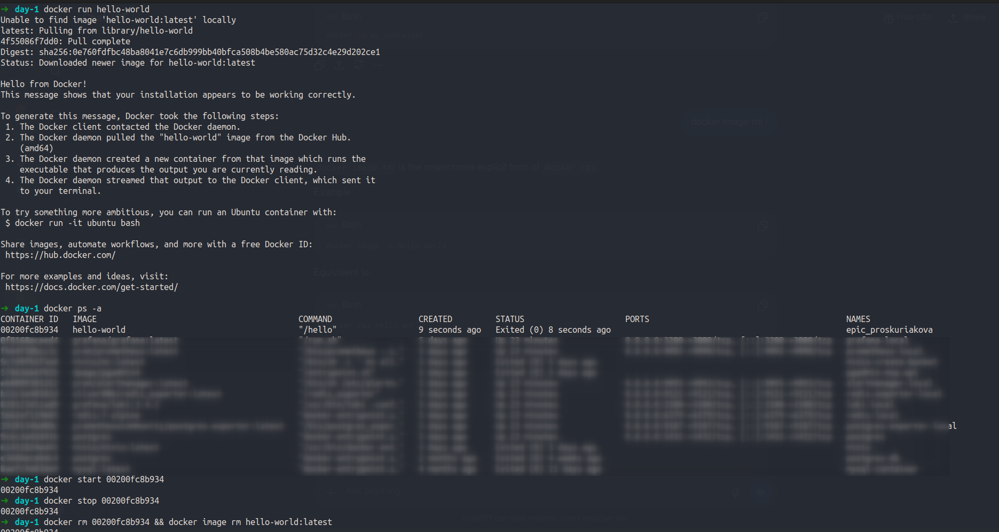
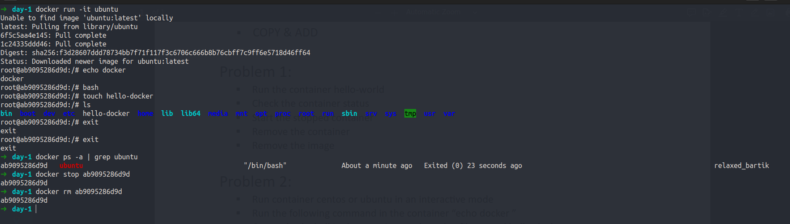
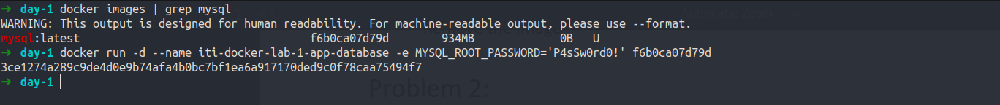
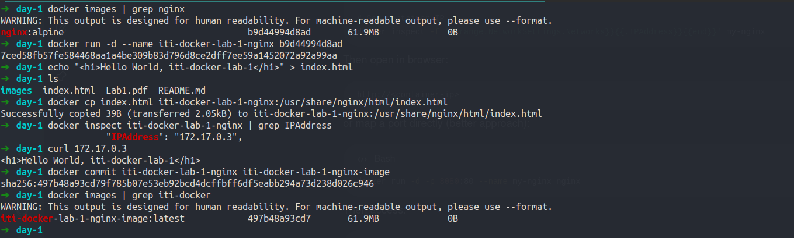
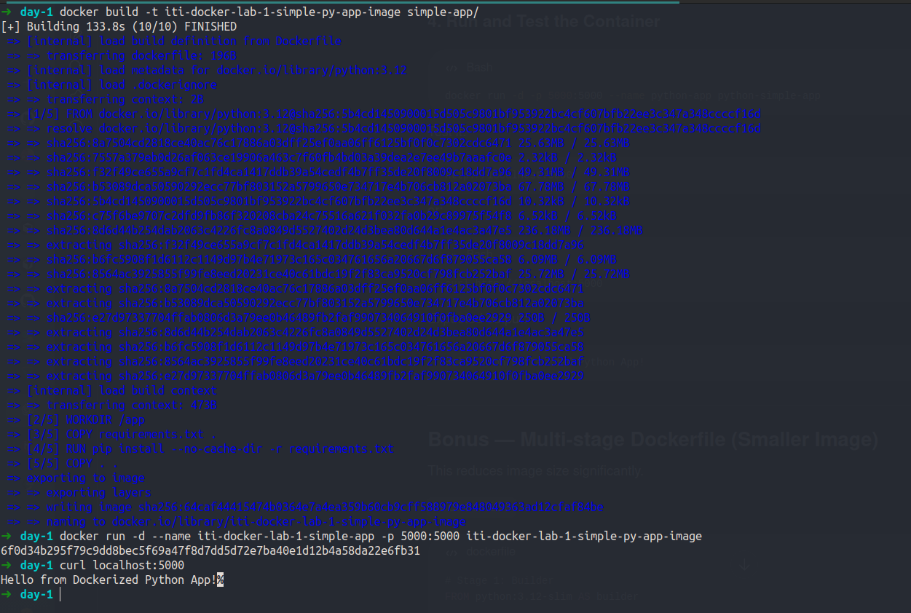

# Docker - Lab 1

## What is the difference between:

### CMD vs ENTRYPOINT

**CMD:**

- Specifies default arguments for the container's main process.
- Can be overridden by supplying commands after the command `docker run`.

**ENTRYPOINT:**

- Sets the main executable for the container.
- Anything provided with `docker run` is passed as arguments to the ENTRYPOINT.
- Can NOT be overridden by supplying commands after the command `docker run`.

### COPY vs ADD

**COPY**

- Copies new files or directories from the build context into the image.
- Only supports local paths (files or directories in the build context).
- Does not fetch URLs or auto-extract archives.

**ADD**

- Can copy local files and directories like `COPY`.
- Additionally supports:
    - A **URL** as the source (downloads the file into the image).
    - **Automatic extraction** when the source is a local tar archive (contents are unpacked into the destination).

### Problem 2:

### Problem 2:

The file `hello-docker` will is deleted once the container is removed.

### Problem 3:

I used the image id in order to use the locally existing `mysql` image instead of downloading a new one.

### Problem 4:

### Problem 5:

